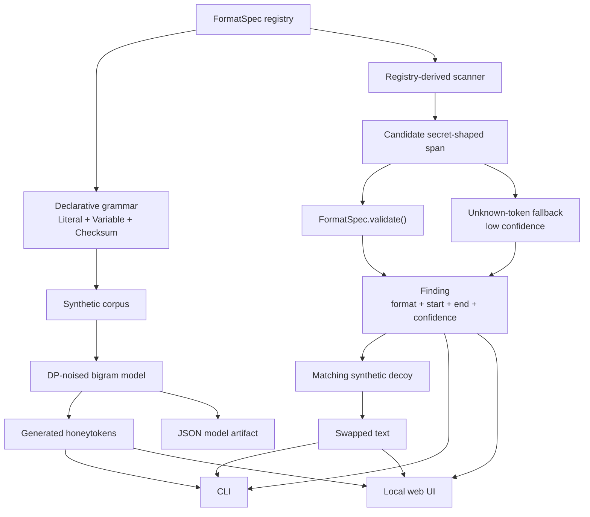

# DP-HONEY

Generate synthetic honeytokens, scan text for secret-shaped strings, and replace
detected tokens with non-functional decoys.

DP-HONEY is a small Python package for credential-leak detection research. It
creates values that look like common secret families, but are never
provider-valid, signed, decryptable, authenticated, or usable credentials.

---

## Install

Requires Python >= 3.11.

```bash
pip install -e .
```

For tests:

```bash
pip install -e ".[dev]"
```

For the local web UI:

```bash
pip install -e ".[ui]"
```

> [!IMPORTANT]
> DP-HONEY runs locally. It does not send scanned text, generated tokens, or
> model artifacts to a service. The `train` command can create JSON model files
> at paths you choose, and the web UI serves only on localhost by default.
> Generated values are synthetic decoys, not real credentials.

---

## See It Work

Generate a checksum-valid GitHub-shaped decoy:

```bash
python -m detect.dp_honey generate --format github-ghp --count 1 --seed 1
```

Scan text without echoing matched values:

```bash
python -m detect.dp_honey scan --file suspect.txt
```

Replace detected tokens with matching synthetic decoys:

```bash
python -m detect.dp_honey auto-decoy --file suspect.txt --seed 1
```

Example input for the scanner:

```text
GITHUB_TOKEN=<paste a locally generated github-ghp decoy here>
CUSTOM_TOKEN=vendor_live_abC123XYZ999qweRTY456mno
```

A generated GitHub decoy is classified as a registered `github-ghp` format. The
custom token falls back to `unknown-token` with low confidence and receives a
same-shape replacement.

---

## What It Does

DP-HONEY has three pieces:

- **Generator:** creates synthetic, shape-only honeytokens from declarative
  format specs.
- **Scanner:** finds registered token shapes in text and confirms them with the
  same validator used by the generator.
- **Auto-decoy:** scans text, generates one matching decoy per finding, and
  returns swapped text with detected spans replaced.

Known formats get stronger classification. Unknown token-like strings are handled
by a low-confidence fallback that preserves visible shape, prefixes, separators,
and character classes where possible.

---

## Unregistered Token Fallback

If pasted text contains a token that is **not** in the registered format list,
DP-HONEY still tries a best-effort fallback. Long, high-entropy, token-like
strings are reported as:

```json
{
  "format": "unknown-token",
  "confidence": "low"
}
```

`auto-decoy` then creates a same-shape replacement. It preserves obvious fixed
parts such as prefixes and separators, while changing the random-looking body.

```text
CUSTOM_TOKEN=vendor_live_abC123XYZ999qweRTY456mno
```

becomes something shaped like:

```text
CUSTOM_TOKEN=vendor_live_xqL847MNP123rtyUIO902abc
```

Fallback decoys are **shape-only**. DP-HONEY cannot infer unknown provider
checksums, signatures, account IDs, tenant IDs, expiration rules, or backend
validity.

---

## Quickstart

List supported formats:

```bash
python -m detect.dp_honey list-formats
```

Preview synthetic training examples:

```bash
python -m detect.dp_honey preview-corpus --format github-ghp --count 3 --seed 0
```

Generate decoys directly:

```bash
python -m detect.dp_honey generate --format aws-access-key-id --count 5 --seed 1
```

Train and save a reusable model:

```bash
python -m detect.dp_honey train --format github-ghp --out models/ghp.json --corpus-size 200 --seed 7
```

Generate from a saved model:

```bash
python -m detect.dp_honey generate --model models/ghp.json --count 5 --seed 1
```

Run the web UI:

```bash
python -m detect.dp_honey.webui
```

Then open:

```text
http://127.0.0.1:8000
```

---

## Command Reference

| Command | Purpose |
| --- | --- |
| `list-formats` | List every registered synthetic format. |
| `preview-corpus` | Print uniformly sampled synthetic examples for one format. |
| `generate` | Train on the fly or load a model and emit honeytokens. |
| `train` | Train a DP-noised bigram model and save a JSON artifact. |
| `inspect-model` | Leniently inspect model metadata and drift status. |
| `validate` | Strictly validate a saved model artifact. |
| `report` | Generate a batch and compute realism/sanity metrics. |
| `scan` | Detect registered secrets plus low-confidence `unknown-token` fallback matches. |
| `auto-decoy` | Replace registered and fallback findings with synthetic decoys. |

<details>
<summary><b>CLI examples</b></summary>

```bash
# List formats as JSON
python -m detect.dp_honey list-formats --json

# Generate plaintext lines
python -m detect.dp_honey generate --format github-ghp --count 3 --seed 7

# Generate JSON
python -m detect.dp_honey generate --format github-ghp --count 3 --seed 7 --json

# Save a model artifact
python -m detect.dp_honey train --format stripe-sk-live --out models/stripe.json --force

# Validate an artifact
python -m detect.dp_honey validate --model models/stripe.json

# Scan stdin
Get-Content .\suspect.txt | python -m detect.dp_honey scan

# Scan a file and opt in to showing matched values
python -m detect.dp_honey scan --file suspect.txt --show-matches

# Swap detected tokens with decoys
python -m detect.dp_honey auto-decoy --file suspect.txt --seed 1
```

`generate` is capped at 10000 tokens. `report` is capped at 5000 tokens because
metrics materialize the batch.

</details>

---

## Python API

```python
from detect.dp_honey import build_model, generate_honeytokens, load_model, save_model
from detect.dp_honey import scanner

tokens = generate_honeytokens("github-ghp", count=5, sample_seed=1, train_seed=7)

model = build_model("aws-access-key-id", corpus_size=200, train_seed=7)
save_model(model, "models/aws.json", force=True)
reloaded = load_model("models/aws.json")

result = scanner.auto_decoy("CUSTOM_TOKEN=vendor_live_abC123XYZ999qweRTY456mno", seed=1)
print(result["findings"])
print(result["swapped_text"])
```

---

## Web UI

The FastAPI UI is a local-only wrapper around the library. It supports the same
core workflows as the CLI:

- list registered formats
- preview synthetic corpus examples
- generate tokens
- train, inspect, validate, and download model artifacts
- run realism reports
- scan and auto-decoy pasted text

The sidebar sections map to these workflows:

| Sidebar section | What it does |
| --- | --- |
| **Formats** | Shows every registered token family, including its slug, display name, category, description, provider-valid flag, and safety note. Use this to decide which known format to generate or inspect. |
| **Preview corpus** | Generates uniform synthetic examples for one selected format. This shows the raw shape DP-HONEY trains from before any bigram model sampling. |
| **Generate** | Produces synthetic honeytokens. You can train on the fly from a format or sample from a saved model artifact. |
| **Report** | Generates a batch and computes realism/sanity metrics such as validity rate, duplicate rate, character entropy, and average bigram log-likelihood. |
| **Scan & auto-decoy** | Lets you paste text, detect registered secrets plus low-confidence `unknown-token` fallback matches, and return swapped text where detected spans are replaced with synthetic decoys. |
| **Train** | Trains a reusable DP-noised bigram model for a selected format and saves it into the local model library. |
| **Inspect model** | Reads model metadata without enforcing every strict load rule, so you can see schema version, format slug, registry version, privacy settings, alphabet size, safety note, and snapshot status. |
| **Validate** | Strictly validates a model artifact and reports whether it can be safely loaded for generation. Use this as the pass/fail check for saved models. |

Run it with:

```bash
pip install -e ".[ui]"
python -m detect.dp_honey.webui
```

The app serves `http://127.0.0.1:8000` by default. FastAPI docs are available at
`/docs` while the server is running.

---

## Supported Formats

Registered formats include:

- AWS access key IDs and secret-access-key shapes
- OAuth bearer token shapes
- generic `sk-` API keys
- database-password shapes
- JWT-shaped tokens
- OpenSSH private-key markers
- Stripe `sk_live_` keys
- Slack bot/user tokens and webhook URLs
- Google API keys
- OpenAI project keys
- Anthropic API keys
- SendGrid keys
- Twilio account/API key SIDs
- GitHub classic token families
- GitHub fine-grained PAT shapes

Classic GitHub token families (`ghp_`, `gho_`, `ghu_`, legacy `ghs_`, `ghr_`)
carry a valid body-only base62-CRC32 checksum. They are still non-functional:
GitHub has no provider record for them. Fine-grained PATs are structural-only
until a public checksum vector is pinned.

<details>
<summary><b>Scanner confidence levels</b></summary>

| Confidence | Meaning |
| --- | --- |
| `high` | Registry match with checksum validation. |
| `medium` | Registry match with structural validation. |
| `low` | Unknown high-entropy token-like fallback. |

The unknown fallback is useful for replacing custom vendor tokens, but it cannot
know provider rules, checksums, signatures, tenant IDs, or revocation behavior.
It should be treated as same-shape replacement only.

</details>

---

## Architecture

DP-HONEY is registry-driven: one declarative format spec powers generation,
validation, scanning, model artifacts, and documentation checks.



<details>
<summary><b>Core modules</b></summary>

| Module | Role |
| --- | --- |
| `detect/dp_honey/grammar.py` | Declarative literals, variables, checksum segments, validation, snapshots. |
| `detect/dp_honey/formats.py` | Format registry and safety notes. |
| `detect/dp_honey/checksums.py` | Checksum algorithms such as GitHub base62-CRC32. |
| `detect/dp_honey/bigram.py` | DP-noised character bigram training and sampling. |
| `detect/dp_honey/model_io.py` | JSON artifact save/load with fail-closed validation. |
| `detect/dp_honey/realism.py` | Batch metrics such as validity rate and character entropy. |
| `detect/dp_honey/scanner.py` | Registry scanner, unknown fallback, and auto-decoy swapper. |
| `detect/dp_honey/__main__.py` | CLI commands. |
| `detect/dp_honey/webui/` | FastAPI app and static browser UI. |

</details>

<details>
<summary><b>Model artifacts</b></summary>

Saved models are transparent JSON, not pickle files. A model artifact stores:

- schema version
- package/version metadata
- format slug, registry version, spec hash, and spec snapshot
- privacy/training parameters
- model alphabet
- transition probabilities
- synthetic/non-functional safety metadata

Loading fails closed when JSON is malformed, required fields are missing, the
format snapshot/hash has drifted, the format is unknown, probability rows are
invalid, or checksum algorithm IDs are unregistered.

</details>

---

## Safety Boundaries

- Generated values are synthetic and shape-only.
- Outputs are never provider-valid credentials.
- The package must not be trained on real secrets.
- Scanner findings do not include matched values by default.
- `--show-matches` is the explicit opt-in for echoing matched input values.
- `auto-decoy` is not a sanitizer; undetected text remains unchanged.
- Unknown fallback decoys preserve shape only and do not claim checksum or
  provider validity.

---

## Testing

```bash
python -m pytest -q
python -m ruff check detect tests conftest.py
```

The test suite covers registry validation, checksum vectors, model artifact
round-trips, CLI behavior, web UI service/routes, scanner safety properties, and
unknown-token fallback behavior.

---

## Project Layout

```text
detect/dp_honey/          package source
detect/dp_honey/webui/    local FastAPI browser UI
tests/                    pytest suite and fixtures
docs/                     design specs and implementation plans
```

---

## License

MIT. See `pyproject.toml` for package metadata.
