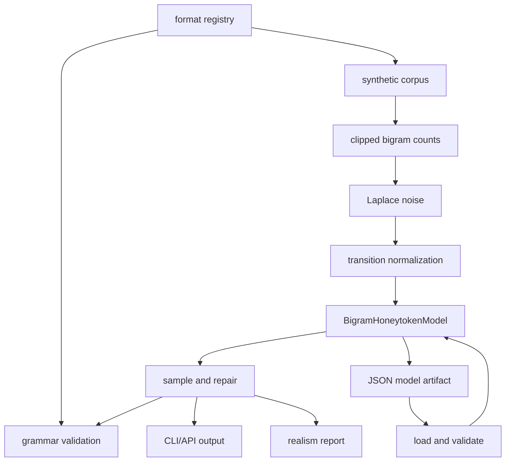
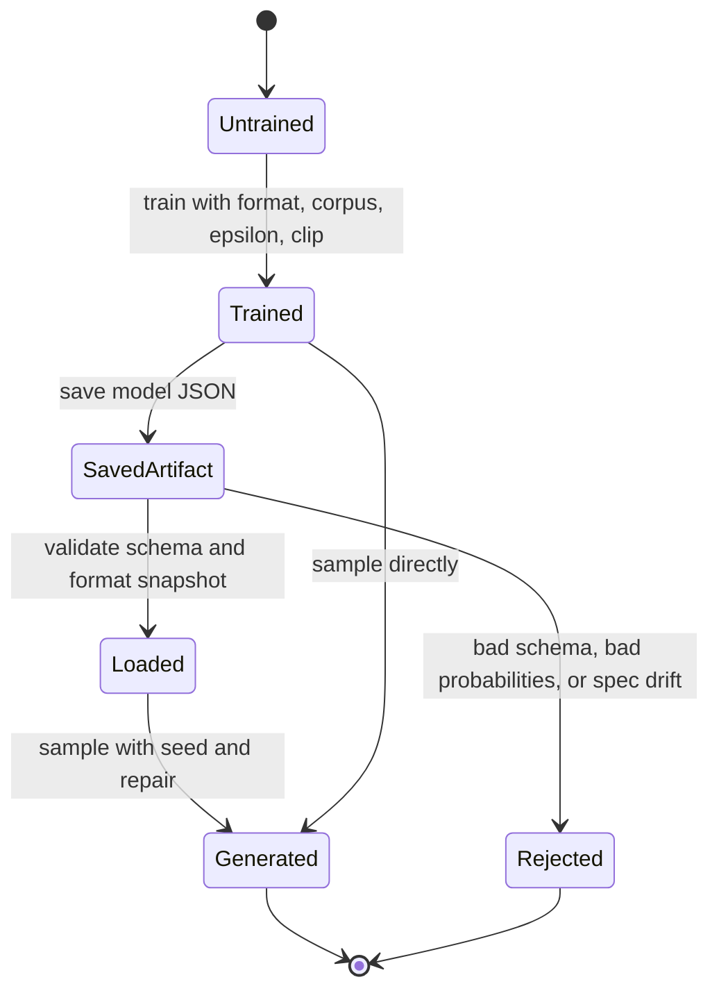

# feat: Build DP-HONEY Generator

## Summary

Build the DP-HONEY generator slice as a small Python package and CLI. The deliverable creates synthetic, nonfunctional honeytokens that look format-compatible across the requested secret families, with a declarative grammar layer, DP-noised bigram sampler, JSON model artifacts, realism reporting, and tests.

---

## Problem Frame

`dphoney.docx` describes a broader detection layer: generator, scanner, conformal calibration, and accounting. This plan covers only the generator because the scanner, calibration, accounting, gateway, and tool-call scanning work belong to other teammates.

The current repo is still mostly source documents and planning artifacts. A CE-executable plan is useful because the gstack plan already chose the product and architecture direction, but it is not shaped as a portable implementation plan with stable requirements, U-IDs, and per-unit test scenarios.

---

## Requirements

**Scope and safety**

- R1. The implementation builds only the DP-HONEY generator package and does not implement scanner, conformal calibration, accounting, gateway, or tool-call scanning behavior.
- R2. Training examples, tests, fixtures, README examples, and demos use synthetic data only; no real credentials are ingested or embedded.
- R3. Generated values are shape-compatible honeytokens, not provider-valid, signed, decryptable, authenticated, or usable credentials.
- R4. The first format registry covers AWS access key ID, AWS secret access key, OAuth bearer token, generic `sk-` API key, database password, JWT-shaped token, SSH/private-key-shaped marker, Stripe `sk_live_`, and GitHub `ghp_`.

**Generation behavior**

- R5. Each format is declared through a compact grammar/spec layer: stable slug, description, fixed literals or prefixes, variable segments, allowed characters, lengths, separators, and provider-validity notes.
- R6. One DP bigram model is trained per format from synthetic format-valid examples, with per-example clipping, Laplace noise controlled by `epsilon`, nonnegative count projection, transition normalization, and seeded sampling.
- R7. Sampling enforces the active format spec by hard mask and bounded repair attempts; impossible repair raises a typed error rather than hanging or emitting invalid output.
- R8. If noisy normalization leaves a transition row with no positive mass, generation falls back to a deterministic, tested uniform distribution over the relevant segment alphabet.
- R9. Same seed, same arguments, same artifact, and same code version produce the same output sequence.

**Artifact and interface contracts**

- R10. Saved models are transparent JSON artifacts with `schema_version: "1"`, privacy/training metadata, format spec snapshot/hash, alphabet metadata, and transition probabilities.
- R11. Loading artifacts fails closed on bad JSON, missing fields, unknown schema versions, format snapshot/hash drift, invalid alphabets, invalid transition rows, non-finite probabilities, negative probabilities, or row sums that are not normalized.
- R12. The public API exposes a simple `generate_honeytokens(...)` entry point and lower-level training/loading helpers without requiring users to understand internal transition-table details.
- R13. The CLI exposes `list-formats`, `preview-corpus`, `train`, `generate`, `inspect-model`, `validate`, and `report`.
- R14. `generate` streams plaintext output one token at a time, while `report` enforces a practical count cap because metrics require batch materialization.
- R15. `train --out` refuses to overwrite an existing model artifact unless `--force` is supplied.

**Documentation and verification**

- R16. The README includes quickstart commands, API examples, artifact schema summary, safety disclaimers, out-of-scope boundaries, and a format compatibility matrix.
- R17. Tests enforce registry coverage, format validation, deterministic seeds, invalid privacy parameters, bounded repair, artifact validation, CLI error exits, report metrics, README matrix consistency, and golden fixture loadability.
- R18. Generated local model artifacts under `models/` are ignored by git; only intentional synthetic fixtures under `tests/fixtures/dp_honey/` are committed.

---

## Key Technical Decisions

- KTD1. **Create a greenfield package under `detect/dp_honey`:** The repo has no existing Python package to extend, so a small source tree plus `pyproject.toml` gives teammates both an import path and a module CLI. Declare a conservative Python floor such as `>=3.11` rather than relying on the local Python version.
- KTD2. **Use a declarative grammar registry, not per-format callbacks:** The broad format set needs one auditable representation for prefixes, segments, charsets, lengths, separators, and safety notes. Arbitrary callbacks would make the first version harder to review and easier to overfit.
- KTD3. **Use NumPy `Generator` APIs for DP noise and sampling:** The plan depends on seeded Laplace draws and probability-weighted character sampling. `numpy.random.default_rng` and `Generator` methods are the right small dependency for that job.
- KTD4. **Treat model JSON as an integration contract:** Saved artifacts are how teammates can reuse the generator without retraining, so load-time validation must prove the artifact is structurally sound before generation begins.
- KTD5. **Fail closed on format drift in v1:** If a saved artifact's format snapshot/hash no longer matches the registry, loading fails with a typed error. Do not add a CLI bypass in the first version; a future migration path can introduce an explicit override if needed.
- KTD6. **Keep provider safety visible at every user-facing surface:** CLI help, `inspect-model`, `validate`, `report`, README examples, and matrix rows should all make clear that outputs are synthetic and shape-only.
- KTD7. **Use pytest as the verification contract:** The implementation is mostly pure functions and CLI behavior. Pytest gives enough coverage for library APIs, CLI invocation, fixture paths, and documentation consistency without adding a heavier test framework.
- KTD8. **Defer CI until the scaffold lands:** A TODO already records GitHub Actions as follow-up work. The first implementation should document local pytest verification, then CI can be added once package layout is real.

---

## High-Level Technical Design

### Component and Data Flow



### Model Lifecycle



### Artifact Contract Sketch

The JSON model artifact is a versioned audit object, not a pickle or opaque binary. It should contain these logical groups:

- schema identity: schema version and generator package/version metadata
- format identity: format slug, registry version/hash, and serialized format snapshot
- privacy/training settings: epsilon, clip, synthetic corpus size, training seed, and training timestamp when available
- alphabet metadata: start token, allowed symbols, and per-segment alphabet references when needed
- transition table: normalized probabilities keyed by previous character, with rows validated before use
- safety metadata: synthetic-only provenance and shape-only/provider-nonvalid disclaimer text

---

## Output Structure

```text
pyproject.toml
.gitignore
detect/
  dp_honey/
    __init__.py
    __main__.py
    bigram.py
    errors.py
    formats.py
    grammar.py
    model_io.py
    realism.py
    README.md
tests/
  fixtures/
    dp_honey/
      golden_model.json
  test_dp_honey_bigram.py
  test_dp_honey_cli.py
  test_dp_honey_docs.py
  test_dp_honey_formats.py
  test_dp_honey_model_io.py
  test_dp_honey_realism.py
```

The tree is a planning target. Implementation may adjust filenames if a clearer local pattern emerges, but every feature-bearing unit below must retain explicit test coverage.

---

## Implementation Units

### U1. Package Scaffold

- **Goal:** Establish the Python project shape, dependency declarations, package import path, and generated-artifact ignore rules.
- **Requirements:** R12, R17, R18.
- **Dependencies:** None.
- **Files:** `pyproject.toml`, `.gitignore`, `detect/dp_honey/__init__.py`, `tests/`.
- **Approach:** Use `pyproject.toml` for static project metadata, `requires-python`, runtime dependency on `numpy`, and a dev/test dependency group or optional extra for `pytest`. Keep the package importable from the repo root. Ignore generated local `models/` output while allowing intentional fixtures under `tests/fixtures/dp_honey/`.
- **Execution note:** Keep this unit small; avoid adding behavior beyond importable package shell and test discovery.
- **Patterns to follow:** Existing repo has no Python scaffold; follow standard Python packaging metadata and keep dependencies minimal.
- **Test scenarios:** Test expectation: none - this unit is scaffold-only. Later units prove package import and test configuration.
- **Verification:** The package can be imported, pytest discovers the test tree, and generated local model paths are ignored without ignoring committed fixtures.

### U2. Declarative Grammar and Format Registry

- **Goal:** Define the format grammar primitives and register every required secret family as shape-only specs.
- **Requirements:** R1, R2, R3, R4, R5, R7, R16, R17.
- **Dependencies:** U1.
- **Files:** `detect/dp_honey/grammar.py`, `detect/dp_honey/formats.py`, `detect/dp_honey/__init__.py`, `tests/test_dp_honey_formats.py`.
- **Approach:** Model each format as a declarative spec with fixed literals, variable segments, allowed characters, lengths, separators, safety notes, and a synthetic corpus generator. Keep JWT and SSH/private-key outputs explicitly shape-only: JWT-like strings are not signed tokens, and SSH/private-key-shaped outputs are markers rather than usable PEM/private-key material.
- **Technical design:** The registry should be the single source of truth for slugs, descriptions, specs, and safety notes. README matrix generation/checks in U7 should read from this registry rather than duplicate the source list by hand.
- **Patterns to follow:** The gstack plan's format list and provider-safety boundary are authoritative.
- **Test scenarios:**
  - Happy path: `list_formats()` returns all required slugs with stable names.
  - Happy path: each format's synthetic examples validate against its own prefix, length, separator, and charset spec.
  - Edge case: requesting an unknown format raises `UnknownFormatError`.
  - Edge case: a fixed literal or prefix mismatch fails validation.
  - Safety case: JWT-shaped and SSH/private-key-shaped formats validate shape but do not produce signed/decryptable/usable credential structures.
- **Verification:** Every required format has a spec, examples, and tests proving internal shape validation.

### U3. DP Bigram Training, Sampling, and Repair

- **Goal:** Implement the DP-noised character bigram model and format-constrained sampling behavior.
- **Requirements:** R2, R3, R6, R7, R8, R9, R17.
- **Dependencies:** U2.
- **Files:** `detect/dp_honey/bigram.py`, `detect/dp_honey/errors.py`, `tests/test_dp_honey_bigram.py`.
- **Approach:** Train per-format bigram counts from synthetic examples, clip per-example contributions, add Laplace noise, project negative counts to zero, normalize rows, and sample variable segments with the active format grammar. Use bounded repair attempts so generation either returns a valid shape or raises `FormatRepairError`.
- **Technical design:** Transition rows with no positive mass after noise projection must fall back to a deterministic uniform distribution over the relevant segment alphabet. This avoids divide-by-zero behavior and keeps low-count/noisy cases testable.
- **Patterns to follow:** Use local RNG objects derived from explicit seeds. Do not use global NumPy random state.
- **Test scenarios:**
  - Happy path: training from a format's synthetic corpus produces a model that samples tokens accepted by that format.
  - Happy path: identical train seed and sample seed produce the same token sequence.
  - Edge case: changing epsilon changes the noisy transition table or resulting distribution in a testable way.
  - Edge case: clipping prevents one repeated example from contributing unbounded repeated bigrams.
  - Error path: epsilon less than or equal to zero raises `InvalidPrivacyParameter`.
  - Error path: clip less than or equal to zero raises `InvalidPrivacyParameter`.
  - Error path: empty corpus raises `EmptyCorpusError`.
  - Error path: impossible repair raises `FormatRepairError` after the configured attempt limit.
  - Edge case: a zero-mass transition row uses the uniform fallback and still samples valid characters.
- **Verification:** The model is deterministic under seed, private-parameter validation is strict, and every generated value validates against the active format.

### U4. JSON Model Artifact Export and Load

- **Goal:** Save trained models as transparent JSON artifacts and load only artifacts that satisfy the full v1 invariant contract.
- **Requirements:** R10, R11, R15, R17, R18.
- **Dependencies:** U2, U3.
- **Files:** `detect/dp_honey/model_io.py`, `detect/dp_honey/errors.py`, `tests/test_dp_honey_model_io.py`, `tests/fixtures/dp_honey/golden_model.json`.
- **Approach:** Serialize model metadata, format snapshot/hash, privacy settings, alphabet data, and transition probabilities as canonical JSON. Validate all invariants before constructing a loaded model. Refuse overwrite by default, with explicit `force` support at the save layer for the CLI to expose.
- **Technical design:** Snapshot drift is a hard load failure in v1. The artifact validator should reject unknown fields only when they change semantics; harmless metadata extensions can be allowed if `schema_version` remains known and required invariants still hold.
- **Patterns to follow:** Keep artifacts inspectable and diffable. Do not use pickle.
- **Test scenarios:**
  - Happy path: save a model, load it, and sample the same output for the same seed.
  - Happy path: committed golden fixture loads and can generate a valid token.
  - Error path: bad JSON raises `ModelArtifactDecodeError`.
  - Error path: missing required fields raise `ModelSchemaError`.
  - Error path: unknown schema version raises `ModelSchemaError`.
  - Error path: format snapshot/hash drift raises `FormatSpecMismatchError`.
  - Error path: unknown format slug raises `UnknownFormatError`.
  - Error path: invalid alphabet membership raises `ModelSchemaError`.
  - Error path: non-finite, negative, or non-normalized transition probabilities raise `ModelSchemaError`.
  - Error path: saving to an existing path without force raises `ModelArtifactExistsError`.
- **Verification:** Artifact round-trip behavior is deterministic and all malformed fixtures fail closed before generation.

### U5. CLI Commands and Error Mapping

- **Goal:** Provide teammate-friendly command-line access to registry discovery, corpus preview, training, generation, inspection, validation, and reporting.
- **Requirements:** R3, R12, R13, R14, R15, R16, R17.
- **Dependencies:** U2, U3, U4.
- **Files:** `detect/dp_honey/__main__.py`, `detect/dp_honey/errors.py`, `tests/test_dp_honey_cli.py`.
- **Approach:** Use argparse subcommands. Map all `DPHoneyError` subclasses to concise stderr messages and nonzero exits. `generate` defaults to plaintext lines and streams one token at a time; JSON output can materialize only within count limits. `report` always validates count limits before generating a metrics batch.
- **Technical design:** Suggested caps are `generate --count <= 10000` for plaintext output and `report --count <= 5000` for metrics. If implementation changes these constants, update CLI help, README examples, and tests together.
- **Patterns to follow:** Keep command output stable enough for teammates to script against. Avoid hidden network calls and provider validation.
- **Test scenarios:**
  - Happy path: `list-formats` includes every registered slug.
  - Happy path: `preview-corpus --format github-ghp --count 3` prints synthetic examples that validate shape.
  - Happy path: `train --format ... --out ...` writes a JSON model artifact.
  - Happy path: `generate --format ... --count 3 --seed ...` emits exactly three valid tokens.
  - Happy path: `generate --model ... --count 3 --seed ...` loads an artifact and emits valid tokens.
  - Happy path: `inspect-model` shows schema, format, epsilon, clip, corpus size, safety metadata, and snapshot/hash status.
  - Happy path: `validate --model ...` exits zero for a valid artifact and nonzero for invalid artifacts.
  - Happy path: `report` emits validity rate, entropy, duplicate rate, average log-likelihood, and debug metadata.
  - Error path: unknown format exits nonzero with a clear message.
  - Error path: existing output path without `--force` exits nonzero.
  - Error path: oversized generate/report counts exit nonzero before expensive work.
  - Safety path: CLI help or command output surfaces synthetic/nonfunctional language.
- **Verification:** CLI commands are covered without relying on real secrets or network access.

### U6. Realism Metrics and Report Data

- **Goal:** Implement lightweight sanity metrics that help demo and audit generated batches without overclaiming indistinguishability.
- **Requirements:** R3, R6, R14, R16, R17.
- **Dependencies:** U2, U3, U4, U5.
- **Files:** `detect/dp_honey/realism.py`, `detect/dp_honey/__main__.py`, `tests/test_dp_honey_realism.py`, `tests/test_dp_honey_cli.py`.
- **Approach:** Report entropy, duplicate rate, format-validity rate, average bigram log-likelihood against the synthetic corpus/model, and debug metadata. Keep claims narrow: metrics are sanity checks for this synthetic generator, not proof that tokens are computationally indistinguishable from real credentials.
- **Patterns to follow:** Reports should be JSON-friendly and deterministic under explicit seeds.
- **Test scenarios:**
  - Happy path: report output includes all expected metric fields and debug metadata.
  - Happy path: a generated batch with valid tokens reports a validity rate of 1.0.
  - Edge case: duplicate-rate calculation handles empty and single-token batches according to the chosen count validation policy.
  - Edge case: entropy calculation handles repeated characters without division errors.
  - Error path: report refuses count values outside the supported range.
  - Safety path: report metadata identifies the source as synthetic and shape-only.
- **Verification:** Report metrics are deterministic for fixed inputs and documented as sanity checks only.

### U7. README, Compatibility Matrix, and Documentation Checks

- **Goal:** Make the generator usable by teammates in a few minutes and keep docs aligned with the registry.
- **Requirements:** R1, R2, R3, R4, R13, R16, R17.
- **Dependencies:** U2, U5, U6.
- **Files:** `detect/dp_honey/README.md`, `tests/test_dp_honey_docs.py`, `tests/test_dp_honey_formats.py`.
- **Approach:** Document install/setup expectations, CLI examples, Python API examples, artifact schema summary, format matrix, safety disclaimers, and out-of-scope boundaries. Add a doc consistency test that parses the matrix and verifies every registered format appears with expected slug/name/scope wording.
- **Patterns to follow:** Keep examples short and synthetic. Do not include long generated token dumps where a few examples prove the point.
- **Test scenarios:**
  - Happy path: every registered format appears in the compatibility matrix.
  - Happy path: matrix entries include shape-only/provider-nonvalid wording.
  - Happy path: README mentions `list-formats`, `preview-corpus`, `train`, `generate`, `inspect-model`, `validate`, and `report`.
  - Safety path: README explicitly states that scanner, calibration, accounting, gateway, and tool-call scanning are out of scope.
  - Safety path: README examples are manually reviewed as synthetic/nonfunctional rather than blocked by generic secret-looking regex tests.
- **Verification:** Documentation and tests agree on supported formats and safety boundaries.

### U8. Golden Fixture and Demo Path

- **Goal:** Provide one stable synthetic fixture and a clear demo path for capstone presentation and teammate integration checks.
- **Requirements:** R2, R3, R10, R11, R13, R16, R17, R18.
- **Dependencies:** U4, U5, U6, U7.
- **Files:** `tests/fixtures/dp_honey/golden_model.json`, `tests/test_dp_honey_model_io.py`, `detect/dp_honey/README.md`.
- **Approach:** Commit exactly one golden model artifact that is synthetic, nonfunctional, schema-valid, and small enough to review. Use it to test load/inspect/report behavior and document a demo sequence that does not require committing generated local `models/` output.
- **Patterns to follow:** The fixture should be generated from the package itself once U4 and U5 exist, then manually reviewed before commit.
- **Test scenarios:**
  - Happy path: fixture loads through `load_model()`.
  - Happy path: fixture passes `validate`.
  - Happy path: fixture can generate deterministic samples for a fixed seed.
  - Error path: if registry spec changes, fixture drift is detected by tests rather than silently accepted.
  - Safety path: fixture metadata states synthetic-only provenance.
- **Verification:** A teammate can inspect the fixture and run the documented demo without retraining first.

---

## Acceptance Examples

- AE1. Given a fresh checkout, when a teammate runs the module CLI's format listing, then every required secret family appears with a stable slug and safety note.
- AE2. Given a fixed format, epsilon, clip, train seed, and sample seed, when the generator is run twice, then the emitted token sequence is identical and every token validates against the internal shape spec.
- AE3. Given a saved model artifact, when it is loaded and sampled with the same seed, then output matches the pre-save model's sampled output.
- AE4. Given an artifact with unknown schema, drifted format snapshot, bad alphabet, or invalid transition probabilities, when it is loaded or validated, then it fails before generation with a typed error.
- AE5. Given a README compatibility matrix missing a registered format, when pytest runs, then the docs consistency test fails.
- AE6. Given an oversized `generate` or `report` count, when the CLI runs, then it exits nonzero with a clear count-limit message and does not begin expensive generation.
- AE7. Given a generated batch, when `report` runs, then it returns validity rate, entropy, duplicate rate, average bigram log-likelihood, and debug metadata.

---

## System-Wide Impact

This plan creates three contracts other teammates can depend on:

- Python import contract: `detect.dp_honey` exposes generator and model helpers.
- CLI contract: `python -m detect.dp_honey ...` can be called from scripts and demos.
- Artifact contract: JSON model files can be inspected, shared, validated, and loaded without retraining.

The work has no database, web server, network provider validation, or long-running service. Security impact comes from producing realistic-looking secret-shaped strings, so documentation and CLI output must keep synthetic/nonfunctional boundaries visible.

---

## Risks & Dependencies

- **Risk: DP noise can zero out transition rows.** Mitigation: define and test uniform fallback for zero-mass rows.
- **Risk: realistic-looking fixtures trigger secret scanners or human concern.** Mitigation: keep fixtures synthetic, include provenance metadata, document manual review, and avoid claiming provider validity.
- **Risk: format specs drift after artifacts are saved.** Mitigation: embed format snapshots and hashes, and fail closed on drift.
- **Risk: seeded output changes across dependency versions.** Mitigation: use explicit local RNG construction, keep a golden fixture test, and avoid promising cross-version determinism beyond same code/artifact/dependency context.
- **Risk: README matrix drifts from the registry.** Mitigation: parse/check the matrix in tests.
- **Risk: local Python is newer than teammates' Python.** Mitigation: avoid Python-version-specific features unless declared in `pyproject.toml`; prefer a conservative `requires-python` floor that teammates can meet.
- **Dependency: NumPy.** Required for Laplace noise and probability sampling.
- **Dependency: pytest.** Required for the planned test suite.

---

## Scope Boundaries

### Active Scope

- DP-HONEY generator package and CLI.
- Declarative format registry.
- Synthetic corpus generation for registered formats.
- DP-noised bigram training and sampling.
- JSON model export/load/validation.
- Realism report metrics.
- README and compatibility matrix.
- Unit and CLI tests.
- One committed synthetic golden fixture.

### Deferred to Follow-Up Work

- GitHub Actions workflow for running pytest automatically. This is already tracked in `TODOS.md` and should wait until the scaffold and test suite exist.
- Package publishing to PyPI or GitHub Releases. Source usage from the repo is enough for this capstone slice.
- Artifact migration tooling for future schema versions.

### Outside This Build

- Scanner implementation.
- Cross-encoding detection.
- Conformal calibration.
- Eq.5 catch-probability accounting.
- Runtime gateway integration.
- Tool-call scanning.
- Provider-valid credential generation.
- Real secret corpus ingestion.

---

## Documentation and Operational Notes

- README examples should use short batches and repeat the synthetic/nonfunctional boundary.
- CLI help should carry enough safety text that generated lines copied into a demo are not mistaken for real credentials.
- Local generated model artifacts should live under `models/`, which remains gitignored.
- The fixture under `tests/fixtures/dp_honey/` is the only planned committed artifact.
- The documented verification path is local pytest until CI follow-up work lands.

---

## Sources and Research

- `dphoney.docx` - primary assignment text for DP-HONEY generator behavior and out-of-scope sibling components.
- `proposal.pdf` - broader Aegis capstone context.
- `2606.04141v1.pdf` - research background for DP-HONEY and related Aegis layers.
- Supplied gstack CEO/engineering plan artifacts - source of accepted scope decisions, review findings, and CI deferral.
- Python Packaging User Guide: `pyproject.toml` project metadata and dependency declaration - https://packaging.python.org/en/latest/specifications/pyproject-toml/
- Python `argparse` documentation: stdlib subcommands and generated help/error behavior - https://docs.python.org/3/library/argparse.html
- NumPy random `Generator` documentation: `default_rng`, `laplace`, and probability-weighted `choice` - https://numpy.org/doc/stable/reference/random/generator.html
- NumPy `Generator.laplace` documentation: Laplace noise draw behavior - https://numpy.org/doc/stable/reference/random/generated/numpy.random.Generator.laplace.html
- NumPy `Generator.choice` documentation: probability-weighted sampling - https://numpy.org/doc/stable/reference/random/generated/numpy.random.Generator.choice.html
- Pytest documentation: fixtures and CLI/library testing conventions - https://docs.pytest.org/en/stable/reference/reference.html
